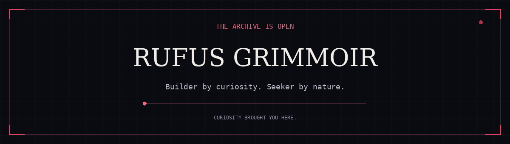

<div align="center">



**Code · Creation · Stories · Questions without easy answers**

`CURIOUS BY NATURE` &nbsp; `DRIVEN BY INTEREST` &nbsp; `STILL SEEKING`

<br>

*“Knowledge is a pure madness.”*

</div>

---

### The person behind the projects

I follow what catches my curiosity. **I work on something for as long as it holds my interest.**

Tools, immersive interfaces, strange experiments—whatever makes me want to look deeper.

<br>

<div align="center">

| ⚒ BUILD | ◈ EXPLORE | ☾ CREATE |
| :---: | :---: | :---: |
| Useful tools | Unfamiliar ideas | Worlds & stories |
| Thoughtful interfaces | How things work | Identity & atmosphere |

</div>

<br>

<details>
<summary><b>＋ OPEN THE WORKSHOP</b></summary>

<br>

```text
A question becomes an idea.
An idea becomes a rough first version.
The first version reveals what I missed.
Then the interesting work begins.
```

**The fuel? Interest.** That is what keeps me working on it.

</details>

<details>
<summary><b>＋ READ A FRAGMENT</b></summary>

<br>

Forgotten stories. Impossible questions. Characters who carry more than they explain.

A little of each finds its way into what I make.

</details>

<details>
<summary><b>＋ LEAVE A TRACE</b></summary>

<br>

Explore the repositories below. If something catches your interest, we already have a starting point.

</details>

<br>

---

<div align="center">

### The work continues.

*Another idea to build. Another detail to refine. Another question to follow.*

<sub>AS LONG AS CURIOSITY HAS SOMETHING TO SAY.</sub>

<br><br>

**RUFUS GRIMMOIR** · THE ENDLESS SEEKER

</div>
